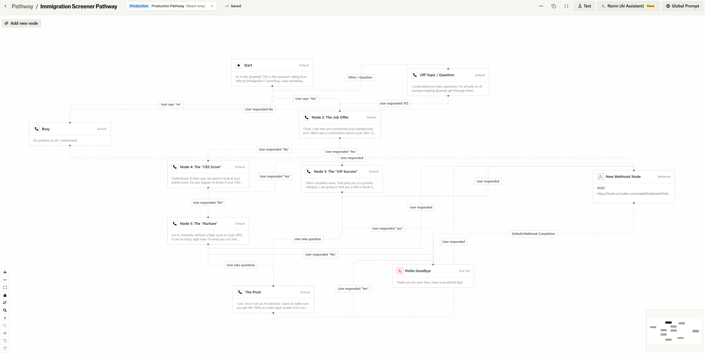

# 🍁 Immi-OS: Autonomous Business Operating System for Immigration Consultants

*An enterprise-grade, AI-driven ecosystem designed specifically for Canadian immigration consultants. Immi-OS acts as an active "digital employee" that monitors the market, prepares clients for high-stakes interviews, enforces financial compliance, and drafts legal documentation.*

---

## 📂 [View System Prompts & Logic Architecture](./prompt.md)

---

## 📌 Executive Summary & Business Impact

By replacing manual administrative, drafting, and coaching work with intelligent automation, Immi-OS delivers significant measurable financial value.  The system is designed to allow a single Senior Partner to handle the caseload of a three-person team. 

| Module Category | Task Automated | Weekly Savings | Annual Value |
| :--- | :--- | :--- | :--- |
| **Admin & Intake** | Screening calls, Data entry, FAQ emails | 10 Hours | $75,000 |
| **Production** | Legal Document Drafting (First Pass) | 5 Hours | $37,500 |
| **Sales Operations** | Contract Sending, Filing & Onboarding | 2 Hours | $15,000 |
| **Service Delivery** | Mock Interview Coaching & Prep | 3 Hours | $22,500 |
| **Finance** | AR Collections & Compliance checks | 2 Hours | $15,000
| **TOTAL** | **Full System Automation** | **22 Hours** | **$165,000+** |

---

## 🏗️ Core Modules & Architecture (Deep Dive)

Immi-OS is orchestrated primarily via Make.com and utilizes a centralized Airtable database for relational design and view-based triggers. Below is the technical breakdown of the core modules that power the ecosystem.  

*(Click to expand any section for architectural details)*

<b>Module A: Multi-Channel Intake & Screening</b>

* **Omni-Channel Capture:** Aggregates incoming leads via Webhook (from Softr/Webflow forms) and Mailhook (parsing raw email bodies). Data is instantly sanitized, formatted, and pushed to a centralized Airtable Leads table.

* **AI Voice Screening (Bland.ai):** An automated trigger fires a POST request to the Bland.ai API within 120 seconds of lead capture. The AI agent, armed with the lead's name and native language, conducts a dynamic qualification interview to verify eligibility constraints (Age, Education, Job Offer).

* **Transcript Analysis & Dynamic Tagging:** Upon call completion, the webhook payload (containing the full transcript) is routed through GPT-4.0 via Make.com. The LLM extracts key data points and updates the Airtable record with a definitive status tag:

    * *VIP:* Lead possesses an immediate pathway and budget. Triggers an urgent Slack ping to the Senior Partner.
    * *Nurture:* Lead lacks a specific requirement (e.g., IELTS score is 0.5 too low). Routed to targeted education. 
    * *Disqualified:* No mathematical pathway exists under current IRPA guidelines.
  

 

<b>Module B: Intelligent Nurture & Education</b>

* **Conditional Logic Routing:** The system doesn't just send generic newsletters. Make.com reads the exact "missing variable" identified by GPT-4.0 in Module A and routes the lead into a highly specific drip sequence

* **The "Nurture" Path:** If a lead needs a higher language score, they receive automated IELTS prep resources. If they need a job, they receive Canadian resume templates. This keeps the firm top-of-mind while the lead improves their profile, requiring zero consultant hours.

* **The "Disqualified" Path:** The system generates a polite, personalized rejection email explaining exactly why they do not qualify, attaching general resources. This protects the firm's brand reputation while completely shielding the consultant from time-wasting follow-ups.

 

<b>Module C: Market Watchdogs (News & Reactivation)</b>

* **Real-Time Monitoring:** Custom automations scrape official immigration news and policy updates.
  
* **Heuristic AI Analysis:** OpenAI analyzes each news update to assign a Priority Level and categorize the impact (e.g., "CRS Score Drop," "New STEM Draw").

* **Active Reactivation Logic (The Database Query):** If the news is positive, Make.com triggers a search within the "Sleeping Leads" Airtable view, querying for profiles that mathematically match the new, lowered criteria.
   
* **The Wake-Up Trigger:** Matches immediately trigger a multi-channel sequence: an urgent Email AND a personalized Bland.ai outbound call stating, *"Good news, the IRCC requirements just changed and your profile is now eligible for submission."*
  

 

<b>Module D: Automated Customer Service (CS)</b>

* **Intent Recognition Routing:** When an existing client sends an email, Make.com routes the text to OpenAI to classify the intent (e.g., Status Update, Document Missing, General Question).

* **Status Inquiries:** For status inquiries, the system searches the client's specific Airtable record, extracts the current stage (e.g., "Awaiting Biometrics"), and drafts a highly accurate, personalized response.
  
* **Milestone Celebrations (HeyGen API):** When a file status shifts to "Approved," Make.com fires a webhook to HeyGen. It passes the client's name and visa type as variables to render a photorealistic Video Avatar of the consultant congratulating them, creating a premium client experience at zero marginal time cost.
  

 

<b>Module E: The "Closer" & Auto-Onboarding</b>

* **Solving Contract Friction:** Eliminates delays in sending agreements and the administrative clutter of manually filing signed PDFs.
  
* **The Pitch:** Once a lead is "Qualified," the system automatically generates the customized Retainer Agreement and emails it immediately.
  
* **The Listener:** The system monitors the inbox for replies with the subject "Retainer Agreement."
  
* **The Filer:** When the signed PDF arrives, the system validates the attachment, auto-saves it to the client’s dedicated Google Drive folder, and updates the Airtable status to "Review Contract."
  
* **Impact:** Reduces "Speed-to-Contract" to near zero, increasing conversion rates while eliminating 100% of document filing work.
  

 

<b>Module F: AI Legal Drafting Assistant</b>

* **The Production Bottleneck:** Legal drafting (Study Plans, Submission Letters) traditionally consumes 1-2 hours of deep work per client.
  
* **Structured Prompt Chaining:** Immi-OS utilizes a multi-step GPT-5.2 Pro architecture. First, it extracts all factual data from the client's intake forms. Next, it applies IRPA-compliant reasoning to structure the argument. Finally, it drafts the narrative.
  
* **Output & Impact:** The system generates a highly formatted, 80% complete first draft directly into a Google Doc, allowing the consultant to bypass the "blank page" and focus strictly on high-level legal strategy and final review.
  

 

<b>Module G: AI Visa Interview Simulator</b>

* **The Feature:** A specialized Bland.ai voice agent configured with a strict, low-latency "IRCC / CBSA Officer" persona, designed to interrupt and pressure-test clients.
  
* **The Workflow:** While most Canadian applications are paper-based, targeted interviews (like Spousal Sponsorships) and Port of Entry (airport) examinations are incredibly high-stakes. Prior to landing or an official summons, the system calls the client and conducts a dynamic 20-minute aggressive roleplay simulation based on their specific case file.
  
* **The JSON Risk Scorecard:** Post-call, the transcript is analyzed by GPT-5.2 pro to generate a strict JSON output evaluating the client's performance (e.g., flagged hesitation on financial questions, contradictory relationship timelines). This provides the consultant with targeted coaching data, replacing hours of manual prep time.
  

 

<b>Module H: Smart Financial Compliance</b>

* **State-Locked Progression:** System progression is intrinsically tied to billing status. When a consultant marks a file as "Ready for Submission" in Airtable, a webhook checks the client's financial balance.
  
* **Automated Collections:** If an outstanding balance is detected, Make.com automatically generates and issues a Stripe invoice to the client.
  
* **The Guardrail:** The system locks the file from moving to the final "Submitted" stage until the payment_intent.succeeded webhook is received from Stripe, guaranteeing 100% payment compliance and eliminating awkward consultant-client money conversations.
  

 

<b>Module I: System Governance (The "Shadow Ledger" & Failsafes)</b>

* **The Problem with Black Boxes:** Standard automations fail silently during API timeouts, resulting in lost data and broken client journeys.
  
* **The Immutable Shadow Ledger:** A universal logging system engineered across all Make.com scenarios.  Every single execution, whether a success or failure, is recorded into a centralized, immutable Airtable database. This tracks the exact payload, the AI prompt, the generated output, and the precise timestamp.
  
* **Failsafe Routing & Redundancy:** Implemented advanced Make.com error handlers (Break, Commit, Ignore, Resume). If a third-party API crashes, the system intercepts the RuntimeError, prevents data loss, securely parks the payload, and triggers an urgent Slack alert containing the error trace for manual resolution.
  
* **Impact:** Achieves true enterprise-grade reliability, ensures zero data loss during API outages, and maintains a 100% transparent audit trail.
  

 

<b>Module J: Executive Dashboard & Quality Assurance</b>

* **The CFO Command Center (Softr):** A secure, role-based web UI built on top of the Airtable base. It visualizes real-time pipeline velocity, conversion rates, and total API spending across the entire automation ecosystem.
  
* **The 5% QA Audit Protocol:** To ensure AI hallucinations do not reach the client, the dashboard features a purpose-built QA interface. It forces the Senior Partner to randomly sample 5% of all AI-generated emails and legal drafts, displaying the underlying prompt alongside the output to guarantee strict legal and tonal compliance.
  

---

## 🛡️ Architecture & Fault Tolerance

Immi-OS is engineered with a **Database-First Safeguard** to ensure 100% data integrity for high-stakes legal documentation.

* **Persistent Queueing (Airtable):** Unlike standard webhooks that "fire and forget," Immi-OS utilizes Airtable as an ACID-compliant staging layer. All incoming client payloads are committed to a permanent record before any logic execution begins.
* **Asynchronous Processing (Make.com):** Automation scenarios are triggered via record monitoring rather than direct HTTP POST requests. This decoupled architecture ensures that if the automation engine is offline, the client data is never dropped, it simply waits in the queue.
* **Auto-Recovery & Sequential Replay:** Once the processing service (Make) is restored, it automatically fetches unhandled records from the Airtable queue and processes them sequentially, maintaining the correct chronological order for legal filings.
* **Multi-Stage Validation:** Every node in the 15-scenario ecosystem contains custom error-handling logic (Break/Resume) to prevent silent failures during PDF generation or compliance checks.

---

## 🚀 Future Vision & Roadmap (V2.0)

* **Implementation of RAG (Retrieval-Augmented Generation):** Transitioning from prompt chaining to a Vector Database (e.g., Pinecone) containing the firm's successful past submissions and the Immigration and Refugee Protection Act (IRPA). Enabling the AI to cite specific case law and mimic the Senior Partner's writing style with high precision.
  
* **The "Consultant Replacement" Model:** By automating legal research and precedent retrieval via RAG, the system will evolve from a "Digital Secretary" to a "Digital Junior Associate." Strategic goal: Reduce the required headcount of junior consultants by 50%, allowing the firm to scale via technology rather than payroll. 

---

**Technology Stack:** *Make.com (Orchestration), Airtable (Database), OpenAI (Intelligence), Bland.ai & HeyGen (Voice/Video AI), Twilio (SMS), Stripe (Payments), Softr (Executive UI & Client Portals).* 

*Note: Immi-OS is a proprietary commercial system developed by Velocyt Consulting. To request a live demonstration of the architecture or discuss custom AI automation deployment for your firm, please reach out directly.*

📍 *Engineered in Mississauga, Ontario, Canada.*
